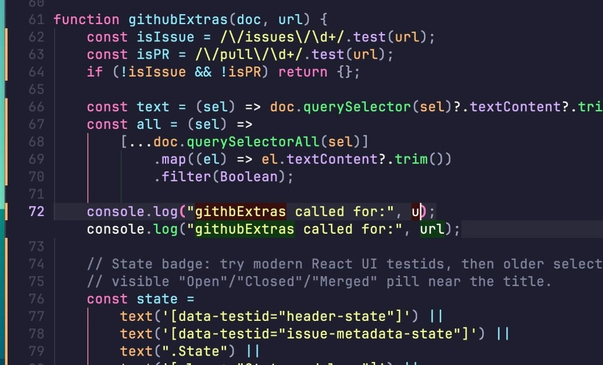

# Emacs — **Catppuccin Mocha × Dracula** contrast blend (wip)

Community member **Violet** shared a **work-in-progress** **Emacs** look: **Catppuccin “Mocha”** as the **base**, with **[Dracula](https://draculatheme.com/)**-palette remaps and **`custom-theme-set-faces!`** overlays for sharper **syntax** and nicer **Magit**, **diff-hl**, **Ediff**, **Flycheck**, **tab-line**, and **treesitter** faces. **Eric Dallo** ([@ericdallo](https://github.com/ericdallo)) called it beautiful — **Violet** runs **Catppuccin × Dracula** across **macOS**/desktop tooling (**Sketchybar** came up aspirationally).

This is **not** a packaged theme—snippet hunting only. Depends on **[catppuccin Emacs](https://github.com/catppuccin/emacs)** primitives **`catppuccin-set-color`**, **`catppuccin-get-color`**, **`catppuccin-reload`**, plus **Doom-isms** (**`custom-theme-set-faces!`**, **`doom-blend`**, **`doom-darken`**, **`doom-lighten`**) typical of **[doomemacs/themes](https://github.com/doomemacs/themes)** configs — lift into your **`init.el`** / **`config.el`** with whatever macro your starter kit provides if you aren’t on **Doom**.

---

## Screenshot (JS buffer + **diff-hl**)



---

## Design notes (**Violet**, paraphrased)

- Palette constants mirror **Dracula** greens / yellow / pinks / cyan / reds.
- **`catppuccin-set-color`** swaps **Catppuccin** semantics (**`maroon`**, **`pink`**, **`lavender`** aliases, overlays **`overlay0`**–**`overlay2`**) then **`catppuccin-reload`**.
- **Face tweaks** unify **strings** (**yellow**), **keywords** (**pink**), **functions** (**green**), **types/builtins** (**cyan** / **`lavender`**).
- **Ediff** / **Magit** / **diff refinement** blends keep low-opacity red/green on **`base`** to echo **inactive**/**active** hunks.
- **`flycheck`** wavy underlines + custom popup-tip faces **`my/flycheck-popup-tip-*`**.
- **`markdown`** **bold vs inline-code** inheritance called out (**Treesitter**/markdown coexistence narrative in-thread).
- **Base flavour** clarified as **Mocha** only experimentation—other **Catppuccin** skins untested snippet-wide.

**Violet** noted the elisp might not be idiomatic—they were still learning. Treat **`my/flycheck-popup-tip-*`** and custom markdown faces as **namespaced to their config**.

---

## Snippet (**as pasted in-chat**, April 2026 — **WIP**)

```emacs-lisp
(let ((my/dracula-green "#50fa7b")
      (my/dracula-yellow "#f1fa8c")
      (my/dracula-foreground "#f8f8f2")
      ;; (my/dracula-purple "#bd93f9")
      (my/dracula-red "#ff5555")
      (my/dracula-orange "#ffb86c")
      (my/dracula-pink "#ff79c6")
      (my/dracula-cyan "#8be9fd")
      (my/lavender "#d6acff"))

  (catppuccin-set-color 'maroon my/dracula-pink)
  (catppuccin-set-color 'pink my/dracula-pink)
  (catppuccin-set-color 'blue my/lavender)
  (catppuccin-set-color 'mauve my/lavender)
  (catppuccin-set-color 'peach my/dracula-orange)
  (catppuccin-set-color 'teal my/dracula-cyan)
  (catppuccin-set-color 'sky my/dracula-cyan)
  (catppuccin-set-color 'sapphire my/dracula-cyan)
  (catppuccin-set-color 'lavender my/lavender)
  (catppuccin-set-color 'yellow my/dracula-yellow)
  (catppuccin-set-color 'green my/dracula-green)
  (catppuccin-set-color 'text my/dracula-foreground)
  ;; Overlay ladder: drop stock overlay0 (fails AA on base); shift 1→0, 2→1;
  ;; new overlay2 capped below subtext0.
  (catppuccin-set-color 'overlay0 "#7f849c")
  (catppuccin-set-color 'overlay1 "#9399b2")
  (catppuccin-set-color 'overlay2 "#a1a7c1")

  (catppuccin-reload) ;; Must reload theme after set-color

;;;; Face Overrides

  (custom-theme-set-faces! 'catppuccin
    `(default :foreground ,my/dracula-foreground)
    `(font-lock-builtin-face :foreground ,my/lavender)
    `(info-string :foreground ,my/dracula-yellow)
    `(font-lock-string-face :foreground ,my/dracula-yellow)
    `(font-lock-function-call-face :foreground ,my/dracula-green)
    `(font-lock-function-name-face :foreground ,my/dracula-green)
    `(font-lock-type-face :foreground ,my/dracula-cyan)
    `(font-lock-keyword-face :foreground ,my/dracula-pink)

    ;; Avy
    `(avy-background-face :foreground ,(catppuccin-get-color 'overlay0) :background ,(catppuccin-get-color 'base))

    ;; Corfu popup
    `(corfu-default
      :inherit nil
      :background ,(catppuccin-get-color 'mantle)
      :foreground ,(catppuccin-get-color 'text))

    ;; Ediff
    ;; Inactive Hunks (The background noise)
    ;; We change these from Grey to subtle Red/Green (10%) to match Magit's "inactive" look.
    ;; Buffer A = Old/Removed (Red), Buffer B = New/Added (Green)
    `(ediff-even-diff-A :background ,(doom-blend my/dracula-red (catppuccin-get-color 'base) 0.1) :foreground unspecified)
    `(ediff-odd-diff-A  :background ,(doom-blend my/dracula-red (catppuccin-get-color 'base) 0.1) :foreground unspecified)
    `(ediff-even-diff-B :background ,(doom-blend my/dracula-green (catppuccin-get-color 'base) 0.05) :foreground unspecified)
    `(ediff-odd-diff-B  :background ,(doom-blend my/dracula-green (catppuccin-get-color 'base) 0.05) :foreground unspecified)

    ;; Active Hunks
    `(ediff-current-diff-A :background ,(doom-blend my/dracula-red (catppuccin-get-color 'base) 0.2) :foreground unspecified)
    `(ediff-current-diff-B :background ,(doom-blend my/dracula-green (catppuccin-get-color 'base) 0.15) :foreground unspecified)
    ;; Fine diffs (word-level highlighting)
    `(ediff-fine-diff-A :background ,(doom-blend my/dracula-red (catppuccin-get-color 'base) 0.4) :foreground unspecified)
    `(ediff-fine-diff-B :background ,(doom-blend my/dracula-green (catppuccin-get-color 'base) 0.3) :foreground unspecified)

    ;; diff-hl
    `(diff-hl-insert :foreground ,my/dracula-green)
    `(diff-hl-delete :foreground ,my/dracula-red)
    `(diff-hl-change :foreground ,my/dracula-orange)

    ;; Flash
    `(flash-match :underline t :foreground ,(catppuccin-get-color 'peach))

    ;; Flycheck underlines
    `(flycheck-error
      :underline (:color ,(catppuccin-get-color 'red) :style wave :position nil))
    `(flycheck-warning
      :underline (:color ,(catppuccin-get-color 'yellow) :style wave :position nil))
    `(flycheck-info
      :underline (:color ,(catppuccin-get-color 'teal) :style wave :position nil))

    ;; Flycheck popup tip faces
    `(my/flycheck-popup-tip-error-face
      :background ,(doom-darken (catppuccin-get-color 'red) 0.6)
      :foreground ,(doom-lighten (catppuccin-get-color 'red) 0.2))
    `(my/flycheck-popup-tip-warning-face
      :background ,(doom-darken (catppuccin-get-color 'yellow) 0.6)
      :foreground ,(doom-lighten (catppuccin-get-color 'yellow) 0.4))
    `(my/flycheck-popup-tip-info-face
      :background ,(doom-darken (catppuccin-get-color 'teal) 0.6)
      :foreground ,(doom-lighten (catppuccin-get-color 'teal) 0.4))

    ;; LSP Mode
    `(lsp-face-semhl-parameter (t (:inherit font-lock-constant-face)))
    `(lsp-proxy-inlay-hint-face :height unspecified :foreground ,(catppuccin-get-color 'overlay0))

    ;; magit
    ;; Section Highlight (The background when you select a hunk)
    ;; Using surface0 to match your "Inactive Ediff" grey
    `(magit-section-highlight :background ,(catppuccin-get-color 'surface0))
    `(magit-diff-context-highlight :inherit magit-section-highlight
      :foreground ,my/dracula-foreground)
    ;; Hunk Headings (The @@ lines)
    `(magit-diff-hunk-heading :inherit magit-diff-context
      :background ,(doom-darken my/lavender 0.6))
    `(magit-diff-hunk-heading-highlight
      :foreground ,(catppuccin-get-color 'mantle)
      :background ,my/lavender
      :weight bold)

    ;; Added lines
    `(magit-diff-added :background ,(doom-blend my/dracula-green (catppuccin-get-color 'base) 0.1)
      :foreground unspecified :extend t)
    `(magit-diff-added-highlight :background ,(doom-blend my/dracula-green (catppuccin-get-color 'base) 0.2)
      :foreground unspecified :extend t)
    ;; Removed lines
    `(magit-diff-removed :background ,(doom-blend my/dracula-red (catppuccin-get-color 'base) 0.1)
      :foreground unspecified :extend t)
    `(magit-diff-removed-highlight :background ,(doom-blend my/dracula-red (catppuccin-get-color 'base) 0.2)
      :foreground unspecified :extend t)
    ;; Word-level diffs
    `(diff-refine-added :background ,(doom-blend my/dracula-green (catppuccin-get-color 'base) 0.4)
      :foreground unspecified :extend t)
    `(diff-refine-removed :background ,(doom-blend my/dracula-red (catppuccin-get-color 'base) 0.4)
      :foreground unspecified :extend t)

    ;; Tab line
    `(tab-line               :background ,(catppuccin-get-color 'base) :foreground "#cdd6f4")
    `(tab-line-tab           :background "#313244" :foreground "#cdd6f4")
    `(tab-line-tab-current   :background ,my/lavender :foreground "#1e1e2e" :weight bold)
    `(tab-line-highlight     :background ,my/lavender :foreground "#1e1e2e")

    ;; Modeline (+light)
    `(mode-line :height 140 :overline ,(catppuccin-get-color 'surface0))
    `(mode-line-inactive :height 140 :overline ,(catppuccin-get-color 'surface0))
    `(mode-line-buffer-id :weight normal)

    ;; Markdown: bold matches inline-code lineage (`md-ts-code` inherits
    ;; `font-lock-constant-face'); single-backtick spans use
    ;; `markdown-inline-code-face' (green) via `my/md-ts-setup-markdown-faces'.
    `(markdown-bold-face :inherit font-lock-constant-face :weight bold)
    `(markdown-inline-code-face :inherit fixed-pitch :foreground ,my/dracula-green)

    ;; Treemacs
    `(treemacs-file-face :foreground ,my/dracula-foreground)
    `(treemacs-directory-face :foreground ,my/dracula-foreground)
    `(treemacs-git-ignored-face :foreground ,(catppuccin-get-color 'overlay0))

    ;; Treesitter Syntax Highlighting
    `(tree-sitter-hl-face:punctuation.special :foreground ,my/dracula-pink)
    `(tree-sitter-hl-face:type.builtin :foreground ,my/dracula-cyan)
    `(tree-sitter-hl-face:variable.parameter :foreground ,my/dracula-orange)
    `(tree-sitter-hl-face:variable.constant :foreground ,my/lavender)
    `(tree-sitter-hl-face:operator :foreground ,my/dracula-foreground)
    `(tree-sitter-hl-face:constant.builtin :foreground ,my/dracula-cyan)))
```

---

## Links

- [Catppuccin for Emacs](https://github.com/catppuccin/emacs)
- [@ericdallo dotfiles — Dracula](https://github.com/ericdallo/dotfiles/)

Thanks **Violet**, **Eric Dallo**, **Tomas Brejla**, and Clojurians thread readers.
